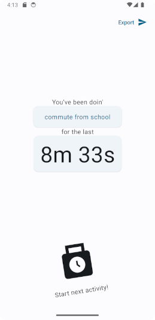
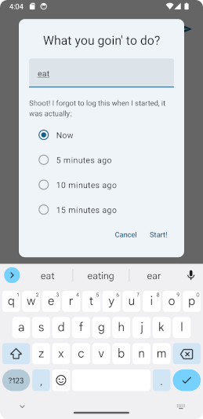
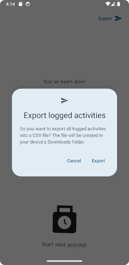

# What Doin'
Minimal android app for personal time tracking

## About
What Doin' is a native Android app time tracker that lets users measure length of tasks throughout the day. It's building principles are simple and non-intrusive user experience, feature minimalism and data privacy.

I wanted an easy and appealing way to track time I spend on public transport, actually doing productive work, exercising etc. The project largely sprung to life because I wanted to develop a native phone application, which I hadn't done before. The scope of simple time tracking software proved feasible to complete in a couple days.

The app lets users input the task they're starting to do, then see precisely how long it's taken so far. The current activity's description can be changed while it is on screen. If the user forgot to log the task when they started doing it, the app provides small 5 to 15 minute windows of logging a new activity in the "past".

All data is stored locally on device and can be exported as a CSV file for analysis. The app itself does not have a screen for comparing past activities or their durations. This is by design. It kept development scope smaller, but also discourages users from constantly monitoring the app.

Can be installed on most up-to-date Android phones via Android Studio. I am planning on packaging the app for Google Play Store, but as of writing What Doin' is not available on any Android app stores.
